<div align="center">

<picture>
  <source media="(prefers-color-scheme: dark)" srcset=".github/assets/logo.svg">
  <source media="(prefers-color-scheme: light)" srcset=".github/assets/logo.svg">
  
</picture>

<br/>

**Fast, modern YouTube downloader & self-hosted Discord music bot - powered by yt-dlp & FFmpeg**

<a href="https://github.com/molexxxx/youtube-downloader/actions/workflows/ci.yml"></a>
<a href="https://github.com/molexxxx/youtube-downloader/actions/workflows/build.yml"></a>
<a href="https://github.com/molexxxx/youtube-downloader/releases"></a>
<a href="LICENSE"></a>
<a href="https://github.com/molexxxx/youtube-downloader/releases"></a>

<br/>

[Download](#install) · [Features](#features) · [Quick Start](#quick-start) · [Contributing](#contributing) · [Report a Bug](https://github.com/molexxxx/youtube-downloader/issues/new?template=bug_report.yml) · [Request a Feature](https://github.com/molexxxx/youtube-downloader/issues/new?template=feature_request.yml)

</div>

---

## Screenshots

<div align="center">

<a href=".github/assets/main-window.png">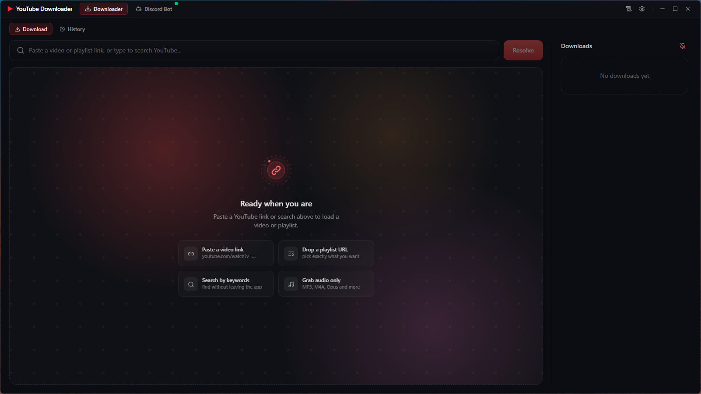</a>

<br/>
<br/>

<table>
  <tr>
    <td align="center" width="215">
      <a href=".github/assets/thumbs/1-youtube-search.png">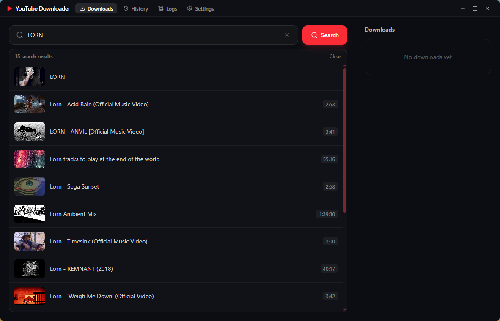</a>
      <br/><sub><b>YouTube Search</b></sub>
    </td>
    <td align="center" width="215">
      <a href=".github/assets/thumbs/2-video-download-details.png">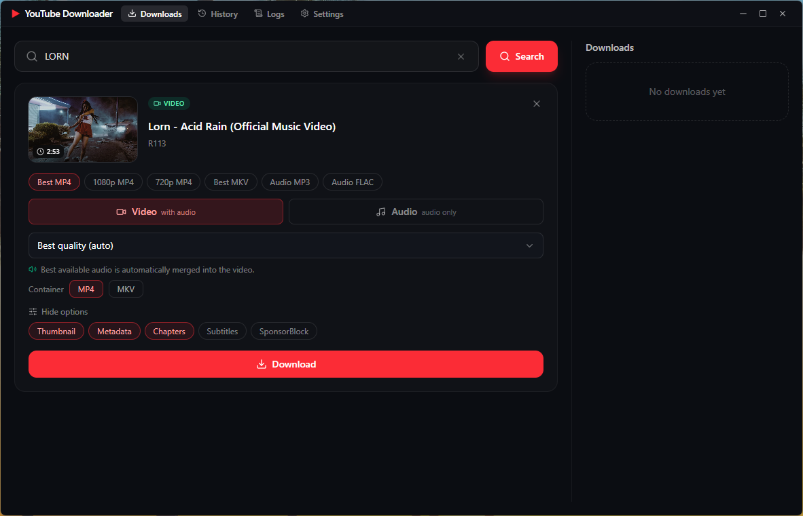</a>
      <br/><sub><b>Video Download Details</b></sub>
    </td>
    <td align="center" width="215">
      <a href=".github/assets/thumbs/3-playlist-download-details.png">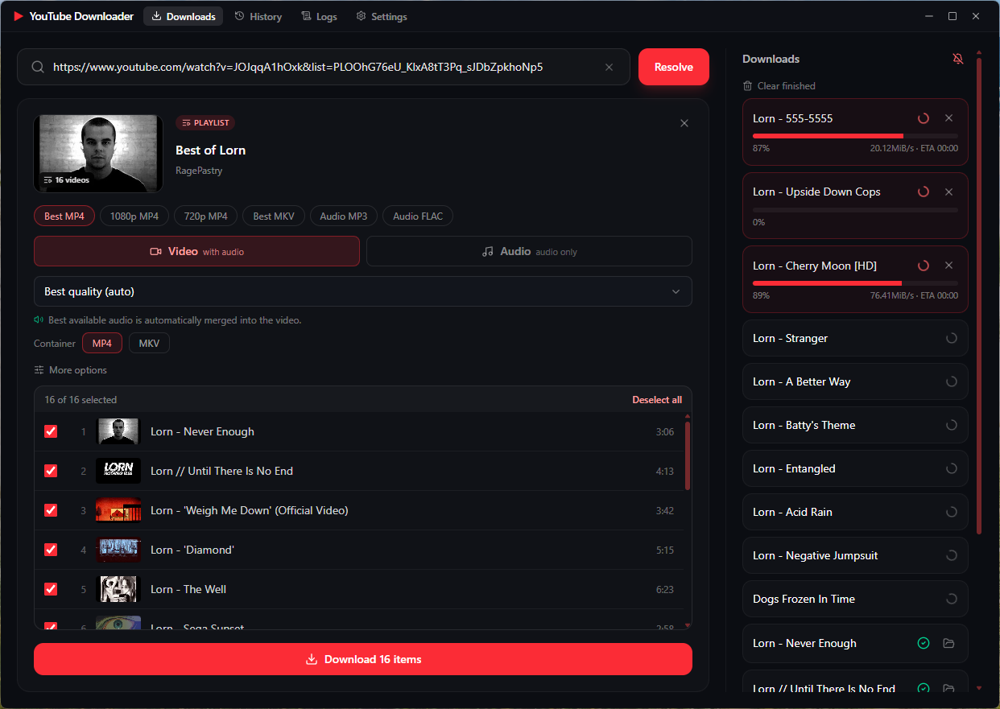</a>
      <br/><sub><b>Playlist Download Details</b></sub>
    </td>
    <td align="center" width="215">
      <a href=".github/assets/thumbs/4-discord-dash.png">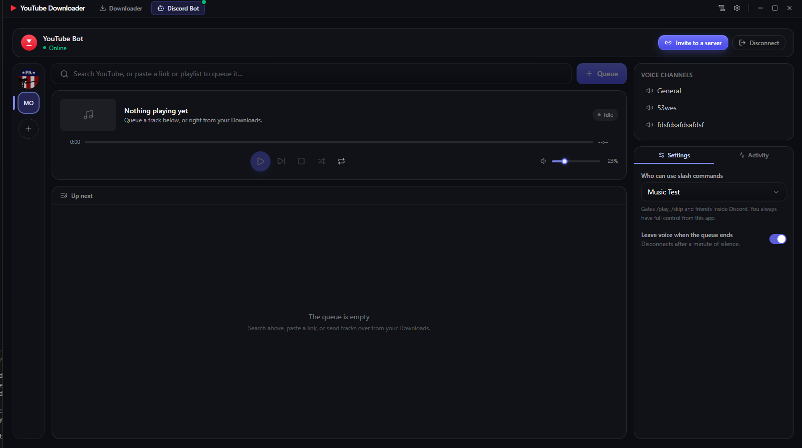</a>
      <br/><sub><b>Discord Dashboard</b></sub>
    </td>
  </tr>
  <tr>
    <td align="center" width="215">
      <a href=".github/assets/thumbs/5-discord-dash-search.png">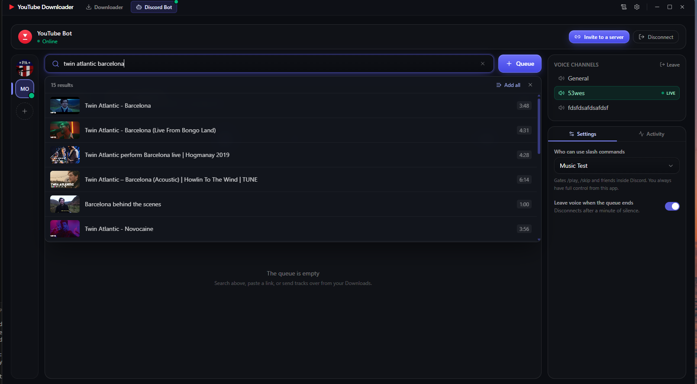</a>
      <br/><sub><b>Discord Dashboard Search</b></sub>
    </td>
    <td align="center" width="215">
      <a href=".github/assets/thumbs/6-discord-dash-playback.png">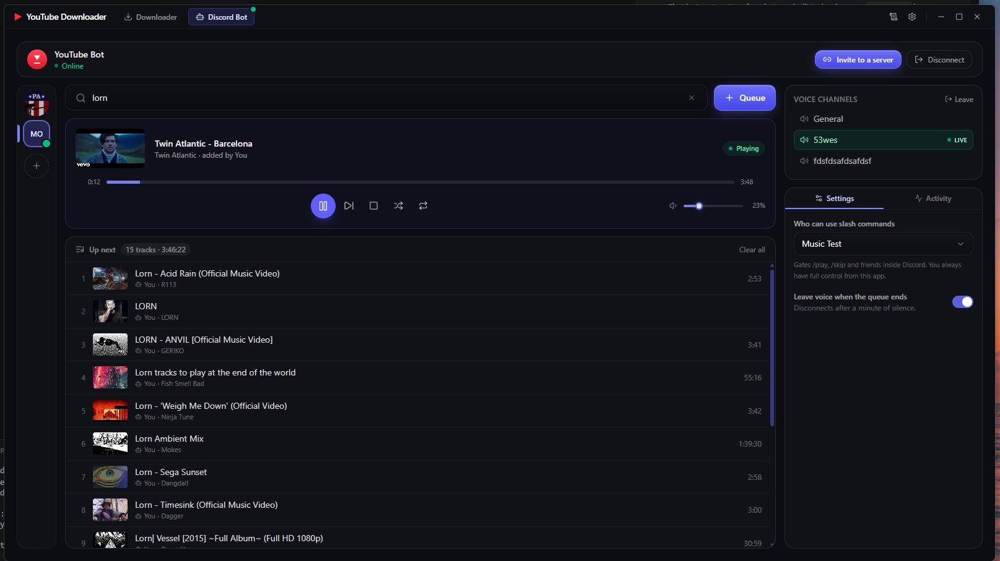</a>
      <br/><sub><b>Discord Dashboard Playback</b></sub>
    </td>
    <td align="center" width="215">
      <a href=".github/assets/thumbs/7-discord-channel.png">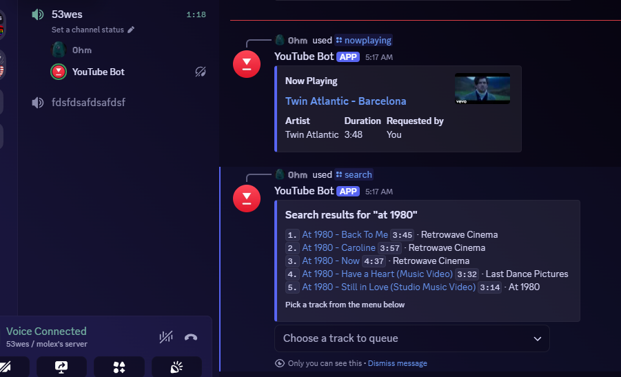</a>
      <br/><sub><b>Discord Channel</b></sub>
    </td>
    <td align="center" width="215">
      <a href=".github/assets/thumbs/8-download-history.png">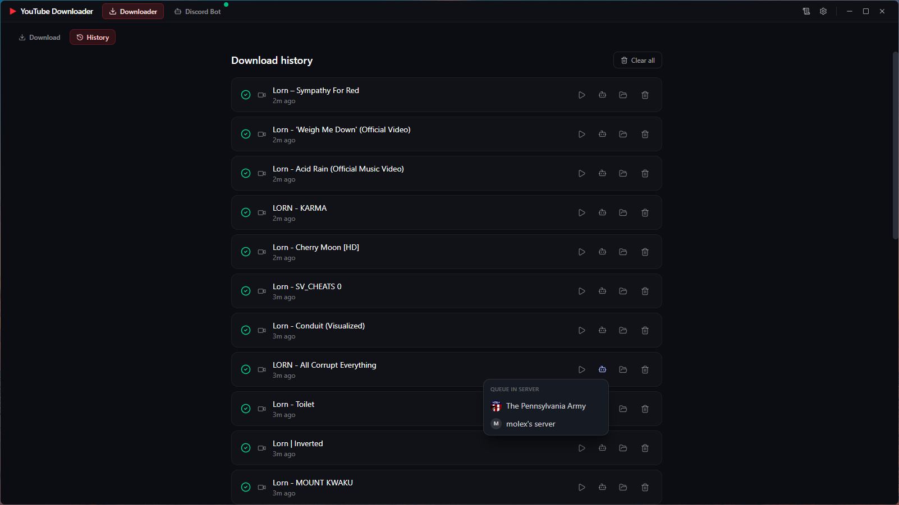</a>
      <br/><sub><b>Download History</b></sub>
    </td>
  </tr>
  <tr>
    <td align="center" width="215">
      <a href=".github/assets/thumbs/9-view-logs.png">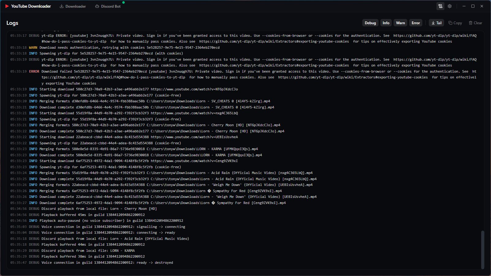</a>
      <br/><sub><b>View Logs</b></sub>
    </td>
    <td align="center" width="215">
      <a href=".github/assets/thumbs/10-settings-top.png">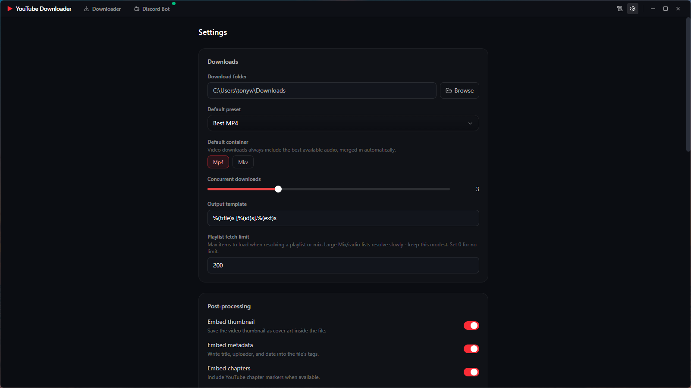</a>
      <br/><sub><b>Settings - Top</b></sub>
    </td>
    <td align="center" width="215">
      <a href=".github/assets/thumbs/11-settings-middle.png">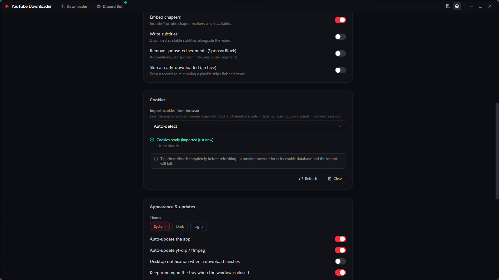</a>
      <br/><sub><b>Settings - Middle</b></sub>
    </td>
    <td align="center" width="215">
      <a href=".github/assets/thumbs/12-settings-bottom.png">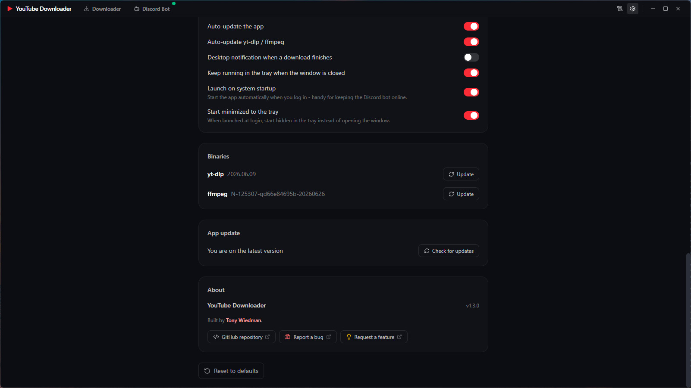</a>
      <br/><sub><b>Settings - Bottom</b></sub>
    </td>
  </tr>
</table>

</div>

---

## Features

### Download & Resolve

- **YouTube Downloads** - Paste a link or search YouTube right from the URL bar (no API key)
- **Videos, Playlists & Channels** - Smart URL detection: a `watch?v=…&list=…` link prompts you to grab just the video or the whole list, while `playlist?list=…`, channels, and Mixes resolve as collections; full or partial selection with "load more" paging past the fetch limit
- **Video Formats** - "Best quality (auto)" with automatic video + best-audio merge, or hand-pick a specific resolution / fps / codec from the enumerated format list (up to 4K when available)
- **Containers** - Output to **MP4** or **MKV**
- **Audio Extraction** - Pull audio-only as **MP3**, **M4A**, **Opus**, **FLAC**, or **WAV** with selectable bitrate (320K / 256K / 192K / 128K / 96K)
- **6 Quick Presets** - Best MP4, 1080p MP4, 720p MP4, Best MKV, Audio MP3, and Audio FLAC - one click applies format, container, and resolution cap
- **Playlist Picker** - Per-item checkboxes with toggle-all; only the selected subset is downloaded
- **Search** - Type keywords to search YouTube via `ytsearch` and resolve any result with a click (thumbnail, title, duration)
- **In-App Video Preview** - Click any thumbnail (resolved video, playlist item, or search result) to watch it in a built-in player modal before committing to a download

### Post-Processing

- **Embed Thumbnail** - Cover art written into the output file
- **Embed Metadata** - Title, uploader, and date written to file tags
- **Embed Chapters** - YouTube chapter markers preserved
- **Subtitles** - Optionally download subtitle files with configurable language codes
- **SponsorBlock** - Automatically strip sponsor / intro / outro segments
- **Download Archive** - Skip already-downloaded items on re-run via an archive file
- **Cookie Support** - Import cookies from your browser (auto-detect or pick one) for age-gated, private, or members-only content, with automatic retry on auth failures

### Queue, Progress & History

- **Concurrent Queue** - Configurable 1–8 simultaneous downloads with per-job cancellation and de-duplication of identical requests
- **Live Progress** - Real-time percent, speed, and ETA per download with desktop notifications on completion or failure
- **History** - Persistent record of every download (title, kind, URL, status, output path, timestamp) with one-click "Show in folder" and clear controls
- **Logs** - Filterable real-time log viewer (debug / info / warn / error) with tail-follow and copy-all

### Discord Music Bot

- **Self-Hosted Bot** - Connect your own bot token (stored locally and encrypted via the OS keychain) and the app becomes a personal Discord music bot; a one-click OAuth invite link adds it to your servers. Free, no subscriptions - the in-app guide walks through the current Developer Portal flow (New Application → Bot tab → Reset Token)
- **Voice Playback** - Stream YouTube audio - single videos or whole playlists - into voice channels through the same yt-dlp + FFmpeg pipeline, including the automatic cookie fallback for age-gated content. Native Opus encoding, generous stream buffering, and automatic voice reconnection keep playback smooth even when the host machine is under load
- **Play Your Downloads** - Send any completed download to a server's queue right from the Downloads or History list; local files play straight from disk with no re-streaming
- **Import Local Audio** - Drag audio files onto the dashboard (or browse for them), preview them with a built-in mini player, and queue them on the bot - MP3, M4A, FLAC, WAV, Opus, OGG, and more
- **In-App Control** - Search or paste links, manage the queue, and drive playback: play / pause / skip / stop, a live seek bar with elapsed time, shuffle, loop (off / track / queue), play-next / reorder, and a per-server volume that's remembered
- **Audio Effects & EQ** - A per-server effects popup with playback speed and pitch (independent, Lavalink-style timescale), a bass / mid / treble equalizer with clip-protection limiting, fun filters (8D rotation, karaoke vocal cut, tremolo, vibrato, echo), and one-tap presets like Nightcore, Slowed, and Bass Boost - applied live through the FFmpeg pipeline
- **Slash Commands** - `/play`, `/search`, `/queue`, `/skip`, `/volume`, `/loop`, and more, registered per-server for instant use; slash commands and the desktop UI drive the **same** player and stay in sync live
- **Multiple Servers** - Manage several servers at once with a Discord-style server rail and an independent queue per server
- **Role Gating** - Optionally restrict slash-command playback to a chosen role (the host app always stays in control)
- **Audit Log** - Persistent, per-server activity feed of who did what - from the app or from Discord - stored locally on your machine

### App & UI

- **Zero Setup** - yt-dlp and FFmpeg are downloaded automatically on first launch, with a guided bootstrap (checking → downloading → extracting → verifying)
- **Binary Manager** - View yt-dlp / FFmpeg versions and update them on demand, or let them auto-update on launch
- **Auto-Updater** - Check / download / install app updates straight from GitHub Releases with live progress
- **Launch on Startup** - Optionally start the app at login on Windows, macOS, or Linux to keep the bot online, with a "start minimized to tray" option
- **Single Instance** - Only one copy runs per machine; launching it again focuses the existing window
- **System Tray** - Live download count and average progress in the tooltip; optional close-to-tray
- **Quick Actions Window** - Pin a compact always-on-top companion window (three sizes) with instant downloads, Discord search and queueing, playback transport, and one-tap server/channel switching - no window juggling
- **Frameless UI** - Custom titlebar, native right-click context menu, and a polished animated empty state
- **Themes** - System, Dark, or Light
- **Desktop Notifications** - Click-to-focus alerts when a download finishes

---

## Install

Grab the latest release for your platform:

| Platform | Download | Format |
|----------|----------|--------|
| **Windows** | [Latest Release](https://github.com/molexxxx/youtube-downloader/releases/latest) | `.exe` (NSIS installer) |
| **macOS** | [Latest Release](https://github.com/molexxxx/youtube-downloader/releases/latest) | `.dmg` installer (Intel & Apple Silicon) |
| **Linux** | [Latest Release](https://github.com/molexxxx/youtube-downloader/releases/latest) | `.deb` / `.rpm` installer |

> yt-dlp and FFmpeg are downloaded automatically on first launch - no manual setup required.

---

## Quick Start

```bash
# Clone & install
git clone https://github.com/molexxxx/youtube-downloader.git
cd youtube-downloader
npm install

# Development (hot-reload)
npm run dev

# Run tests
npm test

# Build for production
npm run build

# Package for distribution
npm run package          # Current platform
npm run package:win      # Windows
npm run package:mac      # macOS
npm run package:linux    # Linux
```

---

## Tech Stack

- **Electron** - Cross-platform desktop framework
- **React 19** - UI with functional components and hooks
- **TypeScript** - Full type safety across main and renderer
- **electron-vite** - Vite build tooling for main / preload / renderer
- **Tailwind CSS v4** - Utility-first styling
- **Zustand** - Lightweight state management
- **Framer Motion** - Animations and transitions
- **Lucide React** - Icon library
- **electron-store** - Persistent configuration
- **electron-updater** - App auto-update from GitHub Releases
- **electron-builder** - Packaging & distribution
- **youtube-dl-exec** - yt-dlp wrapper for resolving and downloading
- **discord.js / @discordjs/voice** - Discord gateway client and voice playback for the music bot
- **libsodium-wrappers / opusscript** - Pure-JS voice encryption and Opus encoding (no native build step)
- **Vitest** - Unit and integration testing

---

## Feedback & Issues

Found a bug or have an idea?

- [**Report a Bug**](https://github.com/molexxxx/youtube-downloader/issues/new) - Something isn't working as expected
- [**Request a Feature**](https://github.com/molexxxx/youtube-downloader/issues/new) - Suggest a new feature or enhancement
- [**Browse Open Issues**](https://github.com/molexxxx/youtube-downloader/issues) - See what's already been reported

Please search existing issues before opening a new one to avoid duplicates.

---

## Contributing

Contributions are welcome! Fork the repo, create a feature branch, and open a pull request. Run `npm run lint`, `npm test`, and `npm run build` before submitting.

---

## License

[MIT](LICENSE) - build cool things with it.

---

<div align="center">
<sub>Downloads are your responsibility - respect the terms of service of the sites you use and the rights of content creators.</sub>
</div>
